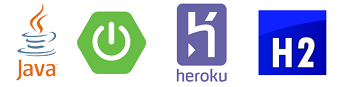
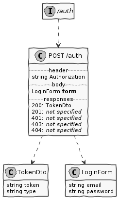
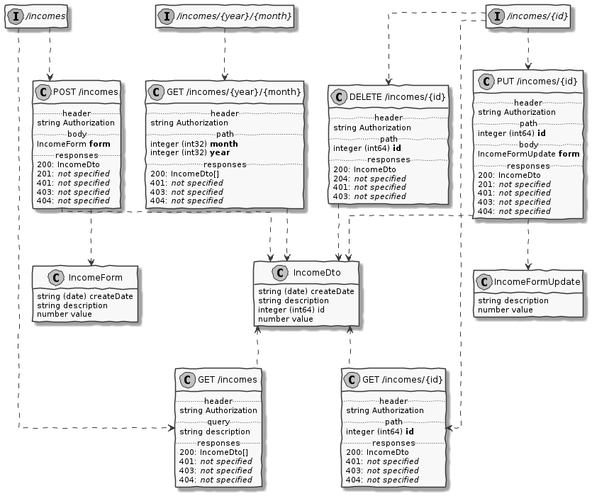
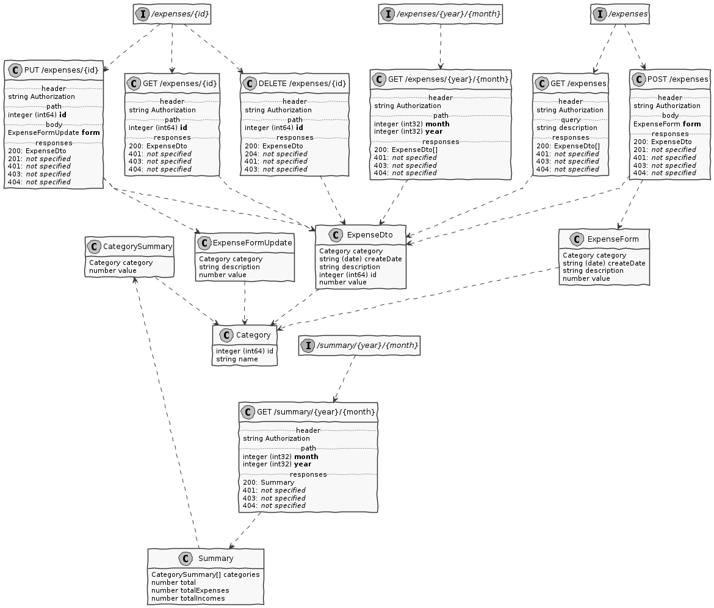

# Budget
 Budget is a simple Rest Api built using Java, Spring Boot, H2 Database for demo propose and running on Heroku.
 The complete list and specification of endpoints and models can be viewed through the link bellow generated using Swagger by Heroku, as well as a demonstration of its execution.
 
 **BudgetApi**: https://cvdambudget.herokuapp.com/swagger-ui.html#/
  
 
 
Below is a graphical representation using the Unified Modeling Language of the classes and endpoints present in the Api generated from documentation.


<b>Authorization related endpoint and getting a beared token</b> | 
:--- | 
 | 
<b>Incomes related endpoints</b> |
 | 
<b>Expenses related endpoints</b> |
| 
```

