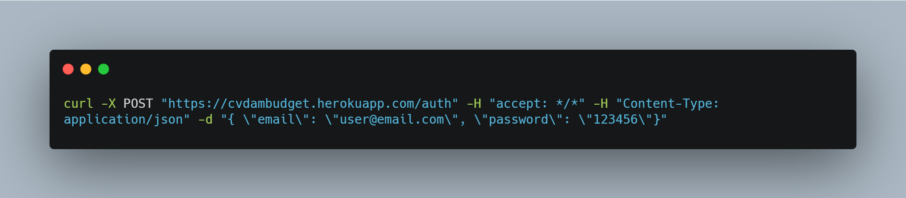
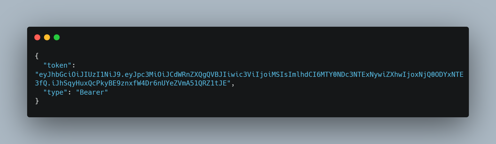
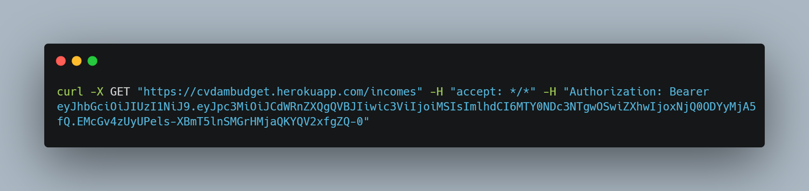
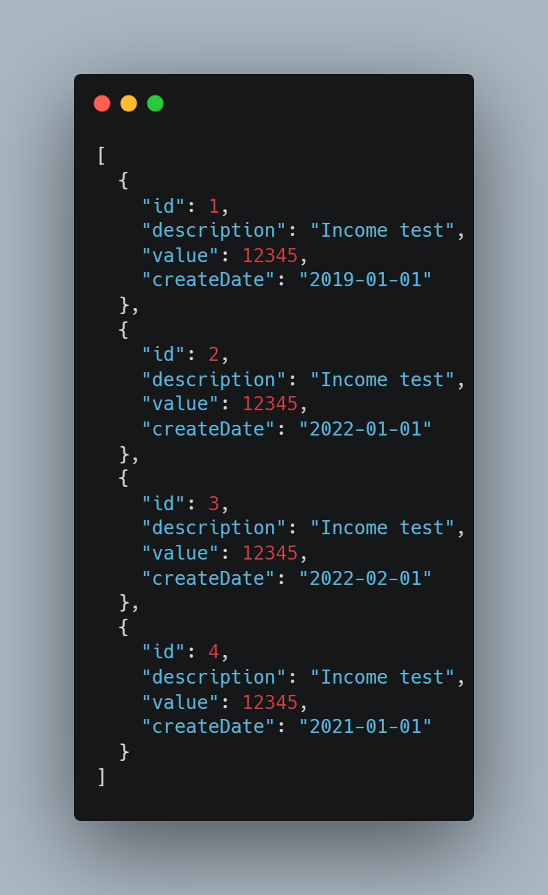

# Budget
 Budget is a simple Rest Api for recording incomes and expenses, access control and summary, built using Java, Spring Boot, H2 Database for demo propose and running on Heroku.
 

 
 ## Deploy and Api Documentation
 The complete list and specification of endpoints and models can be viewed through the following link generated using Swagger by Heroku, as well as a demonstration of its execution:  https://cvdambudget.herokuapp.com/swagger-ui.html#/
  
 
Below is a graphical representation using the Unified Modeling Language of the classes and endpoints present in the Api generated from Swagger api file documentation using [Swagger to UML project](https://github.com/nlohmann/swagger_to_uml) and [PlantUml plugin for Visual Studio Code](https://marketplace.visualstudio.com/items?itemName=jebbs.plantuml).

<b>Authorization related endpoint and getting a bearer token</b> | 
:--- | 
 | 
<b>Incomes related endpoints</b> |
 | 
<b>Expenses related endpoints</b> |
|

## Example
 
Below how to do authentication and query of some incomes registered in the H2 memory database when the api runs.
This example shows how to perform the test using the command line, however the same can be done visually using the [Budget Api Documentation](https://cvdambudget.herokuapp.com/swagger-ui.html#/) generated using Swagger.

First the below command line should be run with the credentials for authentication.
 

  
If authentication is successful, then the Bearer token will be returned.

 
 Then using the token, a request is made to the "/incomes" endpoint to obtain the list of incomes registered in the database.
 

 
Finally, if we don't get any exceptions during this execution, a list of incomes is returned in Json format.
 

